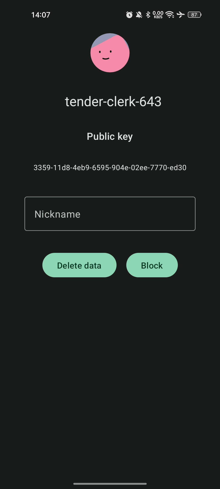
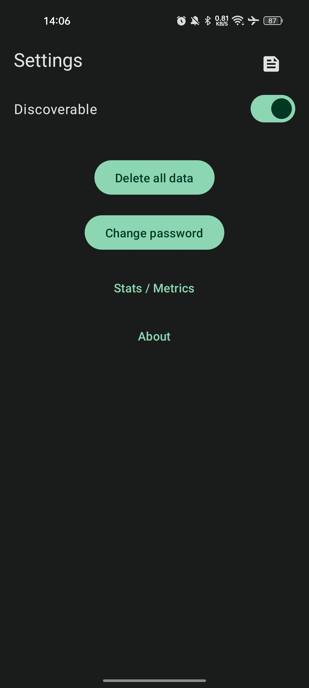

# Meshlink 

# :warning: WARNING: This is still in heavy development, expect bugs and crashes if you try to use this app.

### Decentralized and private peer-to-peer messaging

To read more about MeshLink, visit [meshlink.cstef.dev](https://meshlink.cstef.dev).

## Features

-   **✨ Easy to use:** Just turn on Bluetooth and you're ready to go!
-   **🔒 Private:** None of your data is stored anywhere else than on your device.
-   **🔐 Secure:** Your data is encrypted end-to-end via [RSA-2048](<https://en.wikipedia.org/wiki/RSA_(cryptosystem)>) and locally via [AES-256](https://en.wikipedia.org/wiki/Advanced_Encryption_Standard).
-   **🔗 Decentralized:** No central server, no central authority.
-   **📡 Offline:** MeshLink uses [Bluetooth Low Energy](https://en.wikipedia.org/wiki/Bluetooth_Low_Energy) to communicate with other devices.
-   **📖 Open-source:** This project is open-source and available on [GitHub](https://github.com/cestef/meshlink)
-   **📦 Lightweight:** The universal APK is only ~15 MB in size. (~5MB for the arm64-v8a version)

## Screenshots

    

## Download

