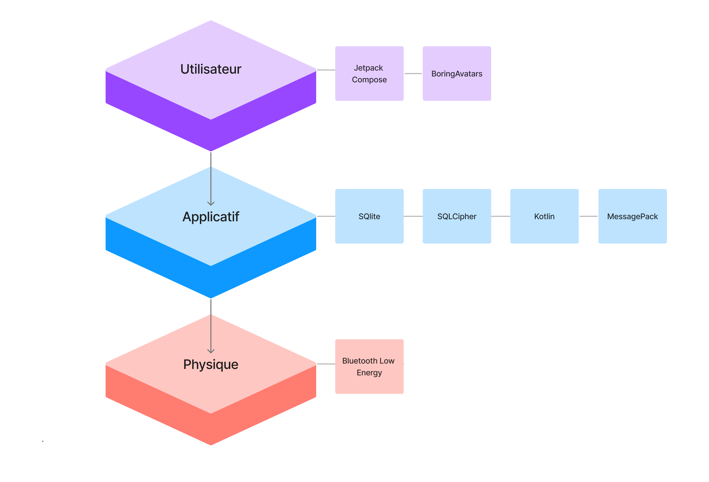
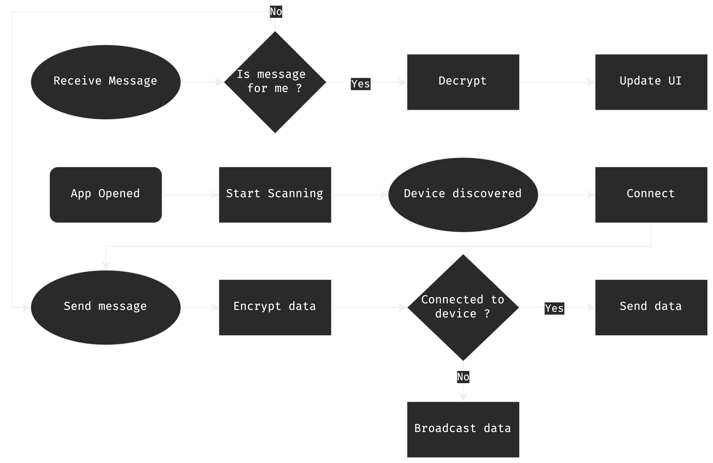
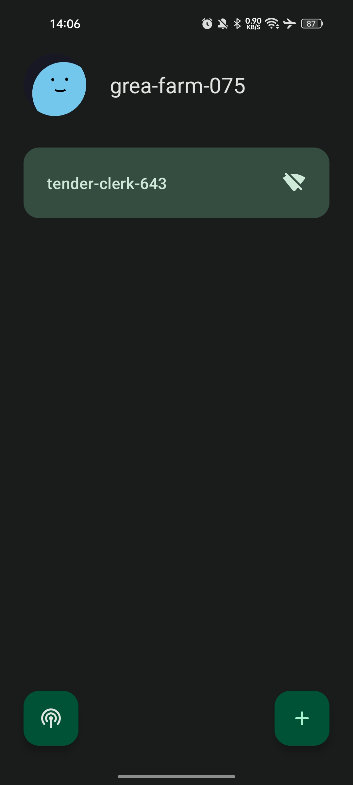
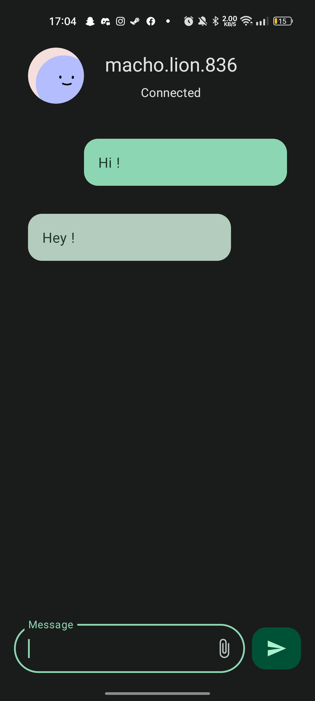
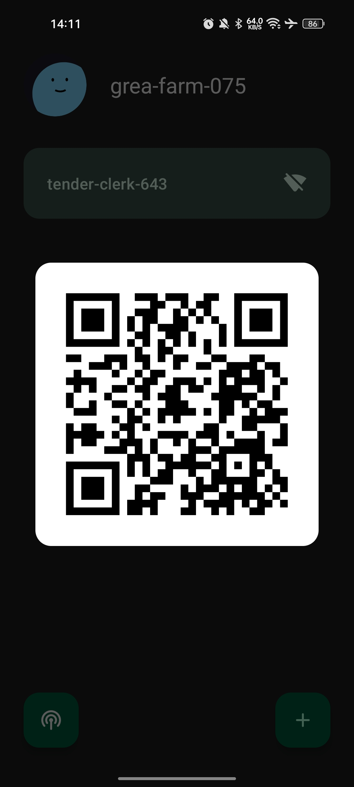
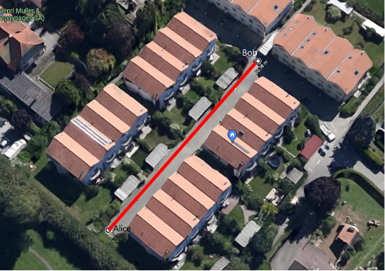
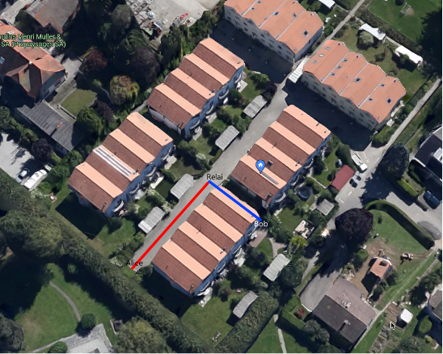
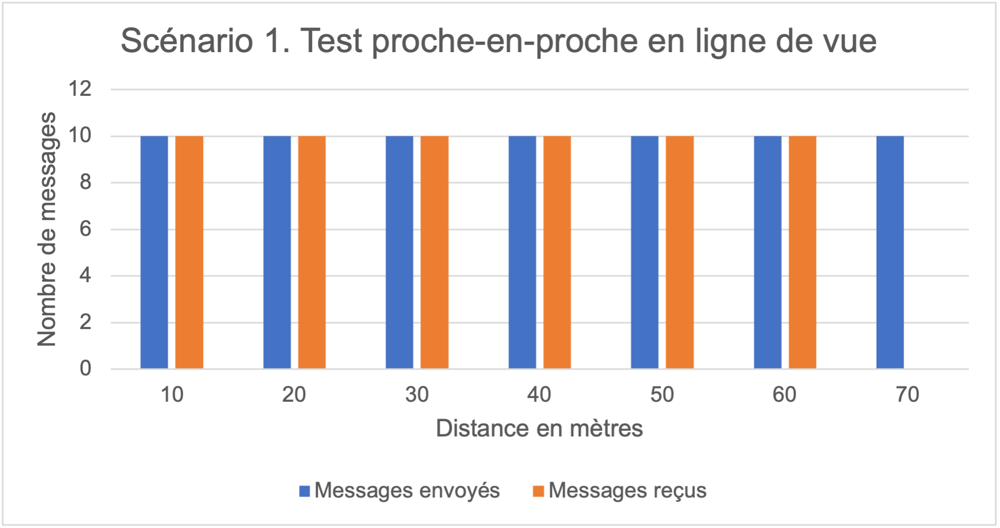

<!--_paginate: false-->

# <!--fit--> Internet of Things - IoT

```kotlin
fun main() {
    println("Hello, MeshLink!")
}
```
#### Par *****REMOVED*****
---

# Contenu de la présentation

1) Problématique
2) Motivations
3) Concept
4) Technologies utilisées

---

# Contenu de la présentation

5) Problèmes rencontrés
6) Rendu final
7) Evaluation
8) Résultats

---

# Contenu de la présentation

9) Analyse et discussion
10) Conclusion

---

# 1. Problématique

<!--
- Question à laquelle j'ai tenté de répondre

- Fil rouge de ce projet

- "en alternative à un réseau mobile":
  - Par exemple:
    - Réseau mobile indisponible (catastrophe naturelle, brouillage, blackout)
    - Réseau mobile censuré


-->

### Comment réaliser un système décentralisé de messagerie utilisant le Bluetooth en alternative à un réseau mobile ?

---

<!--

- La mode actuelle de décentraliser tout et n'importe quoi
  - Blockchain (Bitcoin)
  - Réseaux sociaux (Mastodon)
  - Messagerie (Matrix)

- La prise de conscience de la surveillance de masse
  - Edward Snowden
  - Affaire Huawei

- Mène à une réflexion sur la sécurité des données
  - Chiffrement
  - Sécurité des réseaux

- La passion pour la programmation et l'informatique en général

-->

# 2. Motivations

* :link: Décentralisation

* :closed_lock_with_key: Sécurité

* :heart: Passionné

---

# 3. Concept

* :iphone: Application mobile (Android)

* :speech_balloon: Messagerie instantanée

* :x: Pas de serveur central

* :lock: Chiffré bout à bout

* :white_check_mark: Fonctionne hors ligne

---

# 4. Technologies utilisées

* :iphone: Kotlin

---


<!-- 

- Un langage de programmation moderne qui rend les développeurs plus heureux.

- Si je peux me permettre, j'ai plutôt fini avec des maux de tête et des cheveux arrachés devant du code qui marche pas plutôt que des sourires, mais bon... 
  
-->

---

<!--
- License Apache:
  - Free software
  - Open-source

- Sorti en 2011

- Officiellement supporté par Google pour Android
-->

## Kotlin

* Développé par JetBrains
* Similaire au Java
* Aisé à apprendre
* License: Apache 2.0


---

# 4. Technologies utilisées

- :iphone: Kotlin

- :link: Bluetooth Low Energy (BLE)

---

<!--
- Dérivé basse consommation du Bluetooth

- Géré par le Special Interest Group (SIG)
  - Fondé en 1999
  - Nokia, IBM, Intel, Toshiba, Ericsson

- Standardisé en 2009 (Bluetooth 4.0)

- Consommation: 10x moins que le Bluetooth

- Utilisé dans l'IoT
  - Car fonctionnnent souvent sur batterie

- Omniprésent: Plusieurs milliards d'appareils
-->

## Bluetooth Low Energy

* Initié par Nokia, 2006
* Basé sur le Bluetooth
* Faible consommation
* Omniprésent


---

# 4. Technologies utilisées

- :iphone: Kotlin

- :link: Bluetooth Low Energy (BLE)

- :floppy_disk: SQLite

---

<!-- 
- Utilisé par:
  - Skype
  - Firefox
  - Apple
  - Adobe
  - McAfee

- Uniquement géré par l'applcatif (embarqué)

- Ecrit en C

 -->

## SQLite

* *BDD* relationnelle
* Stockage fichier local
* Populaire, Android
* Open-Source


---

# 4. Technologies utilisées

- :iphone: Kotlin

- :link: Bluetooth Low Energy (BLE)

- :floppy_disk: SQLite

- :lock: SQLCipher

---

<!--
- Open-source pour la version "community"
-->

## SQLCipher

* Chiffrement SQLite AES-256
* Transparent pour l'utilisateur
* Facile à intégrer
* Open-Source (BSD)


---

# 4. Technologies utilisées

- :iphone: Kotlin

- :link: Bluetooth Low Energy (BLE)

- :floppy_disk: SQLite

- :lock: SQLCipher

- :closed_lock_with_key: RSA-2048 + AES-256

---

<!--
- RSA: "Rivest–Shamir–Adleman"
  - Noms des inventeurs

- AES: "Advanced Encryption Standard"
  - Etabli par le NIST (National Institute of Standards and Technology)
-->

## RSA-2048 + AES-256

* Asymétrique (RSA)
* Limite de données
* Symétrique (AES)
* Pas de limite de taille


---

# <!--fit-->Procédure de chiffrement

---

# 4. Technologies utilisées

- :iphone: Kotlin

- :link: Bluetooth Low Energy (BLE)

- :floppy_disk: SQLite

- :lock: SQLCipher

- :closed_lock_with_key: RSA-2048 + AES-256

- :package: MessagePack

---

<!--
- Multi-langages

- Un gars dans un garage
-->

## MsgPack

* Compact et rapide
* Concurrence le JSON
* Format de données binaires
* License: Apache 2.0


---

## Tech-stack

---



---

# Comme dans tout projet...

---
# <!--fit--> 5. Problèmes

---

## Quantité de données par tranmission

* :x: 512 octets (BLE) (-10 octets pour l'en-tête)

---

## Quantité de données par tranmission

- :x: 502 octets (BLE)

---

## Quantité de données par tranmission

- :x: 502 octets (BLE)
- :white_check_mark: Séparation des messages en plusieurs morceaux

---

<!--
- Pour achever une séparation optimale, il faut plusieurs parties:
  - Un en-tête
  - Un corps

- L'en-tête contient:
  - Informations d'identification

- En-tete doit être le plus petit possible
  - Pour maximiser la taille du corps -> données "utiles"

Pour résumer, il faut:
-->

## Séparation

* :label: Identifiables
* :arrows_counterclockwise: Déassemblables / Réassemblables
* :mag: Détection d'erreurs

---

## Structure de l'en-tête d'un morceau


---

## Séparation des messages

$$
\begin{aligned}
n &= \lceil \frac{T}{c} \rceil \\
\end{aligned}
$$

- $n$ : Nombre de morceaux
- $T$ : Taille totale du message
- $c$ : Taille maximale d'un morceau

---
## Exemple

### **Elon** doit absolument envoyer le script entier du film *Shrek* à **Jeff**
#### _(54'350 octets)_
---

## Exemple

$$
\begin{aligned}
n &= \lceil \frac{T}{c} \rceil \\
&= \lceil \frac{54350}{496} \rceil \\
&= \lceil 109.57 \rceil \\
&= 110 \\
\end{aligned}
$$

---

# <!--fit--> **Elon** doit donc envoyer **110** morceaux.

---

<!--
- 10kB/s
-->

## Avec une vitesse de transmission de ~**20** morceaux par seconde, cela prendra ~**5** secondes.

---

## Identifiant d'utilisateur

* :x: `7092b805-e3b1-4a86-bc0a-df80ed89a9c4`

---

## Il fallait qu'il soit...

* :brain: Facile à retenir
* :keyboard: Facile à taper
* :speech_balloon: Facile à communiquer

---

## Format d'un identifiant

### **1 adjectif** + **1 nom** + **3 chiffres**

#### _En anglais_

### Séparés par un **tiret** ou un **point**

---

## Probabilité de collision

$$
\begin{aligned}
P &= \frac{1}{\text{nombre d'identifiants possibles}} \\
&= \frac{1}{\text{nbr d'adjectifs} \times \text{nbr de noms} \times \text{nbr de chiffres} \times \text{nbr de separateurs}} \\
&= \frac{1}{979 \times 1844 \times 1000 \times 2} \\
&= \frac{1}{3.6 \times 10^{9}} \\
\end{aligned}
$$

---

# <!--fit--> 1 chance sur **3.6** milliards


---

## Identifiant d'utilisateur

- :x: `7092b805-e3b1-4a86-bc0a-df80ed89a9c4`
- :white_check_mark: `awesome-unicorn-420`

---


# 6. Rendu final

---


---


---



---





---




---
<!--
- Deux scénarios:
1.	Deux utilisateurs à distance variable (jusqu’à 70 mètres) communiquent de proche en proche, en ligne de vue.

2.	Deux utilisateurs communiquent ensemble sans ligne de vue, via un relai.
-->

# 7. Évaluation

---

# Scénario 1

---

<!--
- Vise à tester la distance maximale
-->



---

# Scénario 2

---

<!--
- Ne vise pas à tester la distance, mais seulement le fonctionnement des relais
-->



---

# 8. Résultats

---

<!--
- Les deux scénarios se sont déroulés sans encombre.

- Les messages ont été reçus dans l'ordre sans aucune perte.

- La distance maximale est plus élevée que prévu.
-->



---

# 9. Analyse et discussion

---

<!--
- Les résultats sont très satisfaisants.

- Le système reste cependant limité par la distance et le temps de vie des messages.
-->

## Limitations

* :straight_ruler: Distance
* :alarm_clock: Time-to-live
* :x: Obstacles


---

## Suffisant ?

<!--
- distance max: D = d * T 
  - où D est la distance maximale, d la distance par saut, et T le nombre de sauts maximum (TTL)
-->

$$
\begin{aligned}
D &= d \times T \\
&= 60\text{ [m]} \times 12 \\
&= 720 \text{ [m]}
\end{aligned}
$$

- $D$ : Distance maximale (en mètres)
- $d$ : Distance par saut
- $T$ : Nombre de sauts maximum

---

<!--
- Pour qu'une telle distance se produise, il faudrait que toutes les conditions soient optimales, ce qui est peu probable.
-->

## Vraiment possible ?

- #### **12** utilisateurs
- #### **60** mètres entre chacun
- #### Obstacles ?
---

<!--
- Beaucoup plus avancé que ce qui était prévu
  - Peut être utilisé dans des situations réelles

- Quelques fonctionnalités qui manquent encore:
  - Signature des messages pour la vérification de l'authenticité
  - Ajout du routage IPv6 / interconnexion avec Internet

- Ce projet c'est aussi:
  - 8000+ lignes de code
  - 200+ heures passées à développer, tester, documenter et optimiser
-->

# 10. Conclusion

---

# <!--fit--> Merci !

---

# <!--fit--> Leave a :star: on GitHub !

<!-- github.com/cestef/meshlink -->


---

# <!--fit--> Questions ?

---

# Sources iconographiques

- https://cdn.icon-icons.com/icons2/2699/PNG/512/sqlite_logo_icon_169724.png
- https://upload.wikimedia.org/wikipedia/commons/thumb/d/da/Bluetooth.svg/1342px-Bluetooth.svg.png
- https://upload.wikimedia.org/wikipedia/commons/thumb/0/06/Kotlin_Icon.svg/2048px-Kotlin_Icon.svg.png
- https://github.com/twitter/twemoji