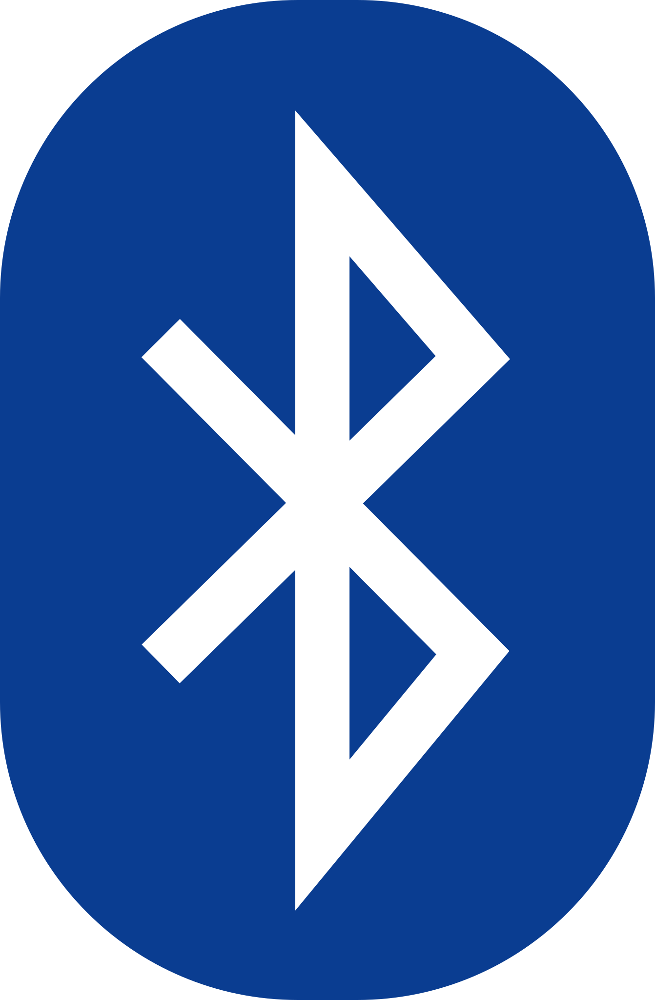
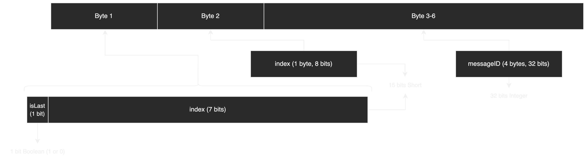
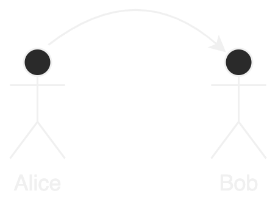
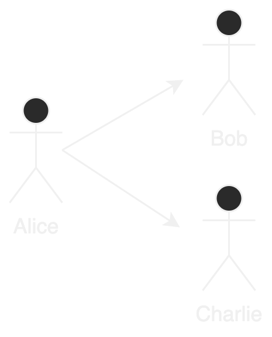
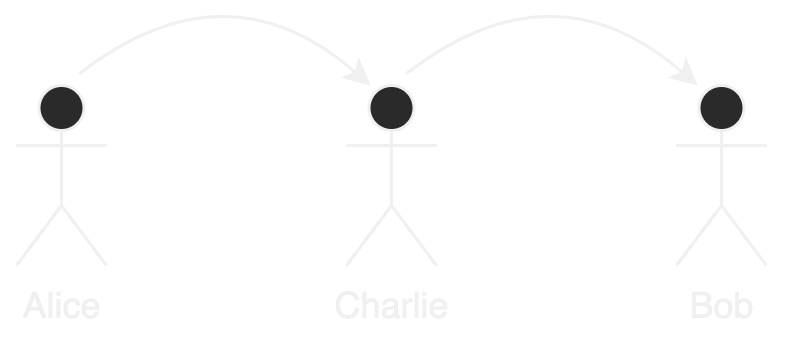

<!--_paginate: false-->

# <!--fit--> Internet of Things - IoT

```kotlin
fun main() {
    println("Hello, world!")
}
```
#### Par **Colin**
---

# Contenu de la présentation

1) Problématique
2) Motivations
3) Concept
4) Technologies utilisées

---

# Contenu de la présentation

5) Schémas
6) Problèmes rencontrés
7) Évaluation
8) Conclusion
9) Démonstration

---

# Problématique

### Comment réaliser un système décentralisé de messagerie utilisant le Bluetooth en remplacement d'un réseau mobile ?

---

# Motivations

* :link: Décentralisation

* :closed_lock_with_key: Sécurité

* :heart: Passionné

---

# Concept

* :iphone: Application mobile (Android)

* :speech_balloon: Messagerie instantanée

* :x: Pas de serveur central

* :lock: Chiffré bout à bout

* :white_check_mark: Fonctionne hors ligne

---

# Technologies utilisées

* :iphone: Kotlin

---


<!-- Un langage de programmation moderne qui rend les développeurs plus heureux. -->

---

## Kotlin

* Développé par JetBrains
* Similaire au Java
* Courbe d'apprentissage faible


---

# Technologies utilisées

- :iphone: Kotlin

- :link: Bluetooth Low Energy (BLE)

---

## Bluetooth Low Energy

* Créé par Nokia en 2006
* Basé sur le Bluetooth
* Consommation réduite (~10x)




---

# Technologies utilisées

- :iphone: Kotlin

- :link: Bluetooth Low Energy (BLE)

- :floppy_disk: SQLite

---

## SQLite

* Permet le stockage de données dans un fichier
* Requêtes SQL
* Utilisé par Android (Room)


---

# Technologies utilisées

- :iphone: Kotlin

- :link: Bluetooth Low Energy (BLE)

- :floppy_disk: SQLite

- :lock: SQLCipher

---

## SQLCipher

* Chiffrement AES-256
* Transparent pour l'utilisateur
* Facile à intégrer


---

# Technologies utilisées

- :iphone: Kotlin

- :link: Bluetooth Low Energy (BLE)

- :floppy_disk: SQLite

- :lock: SQLCipher

- :closed_lock_with_key: RSA-2048 + AES-256

---

## RSA-2048 + AES-256

* Asymétrique (RSA)
* Limite de données
* Symétrique (AES)
* Pas de limite de taille


---

## Procédure de chiffrement

### **Bob** envoie un message à **Alice**

1) <u>Bob</u> génère une clé éphémère AES-256 aléatoire
2) <u>Bob</u> chiffre le message avec la clé AES-256
3) <u>Bob</u> chiffre la clé éphémère avec la clé publique RSA-2048 d'<u>Alice</u>
4) <u>Bob</u> envoie le message et la clé chiffrés à <u>Alice</u>

---

## Procédure de déchiffrement

### **Alice** reçoit un message de **Bob**

1) <u>Alice</u> déchiffre la clé éphémère (AES-256) avec sa clé privée (RSA-2048)
2) <u>Alice</u> déchiffre le message avec la clé éphémère

---

# Technologies utilisées

- :iphone: Kotlin

- :link: Bluetooth Low Energy (BLE)

- :floppy_disk: SQLite

- :lock: SQLCipher

- :closed_lock_with_key: RSA-2048 + AES-256

- :package: MessagePack

---

## MsgPack

* Compact et rapide
* Concurrence le JSON
* Format de données binaires


---

# Comme dans tout projet...

---
# <!--fit--> Problèmes

---

## Quantité de données par tranmission

* :x: 512 octets (BLE) (-10 octets pour l'en-tête)
* :white_check_mark: Séparation des messages en plusieurs morceaux

---

## En-tête d'un morceau



---

## Quantité de données par tranmission

- :x: 502 octets (BLE)
- :white_check_mark: Séparation des messages en plusieurs morceaux

---

## Séparation des messages

$$
\begin{aligned}
n &= \lceil \frac{T}{c} \rceil \\
\end{aligned}
$$

- $n$ : Nombre de morceaux
- $T$ : Taille totale du message
- $c$ : Taille maximale d'un morceau

---

## Exemple

### **Elon** veut envoyer le script entier de Shrek à **Jeff**
#### _(54'350 octets)_
---


$$
\begin{aligned}
n &= \lceil \frac{T}{c} \rceil \\
&= \lceil \frac{54350}{502} \rceil \\
&= \lceil 108.3 \rceil \\
&= 109 \\
\end{aligned}
$$

---

# <!--fit--> **Elon** doit donc envoyer **109** morceaux.

---

## Avec une vitesse de transmission de ~**20** morceaux par seconde, cela prendra ~**5** secondes.

---

## Identifiant d'utilisateur

* :x: `7092b805-e3b1-4a86-bc0a-df80ed89a9c4`
* :white_check_mark: `awesome-unicorn-420`

---

## Il fallait qu'il soit...

* :brain: Facile à retenir
* :keyboard: Facile à taper
* :speech_balloon: Facile à communiquer

---

## Format d'un identifiant

### **1 adjectif** + **1 nom** + **3 chiffres**

#### _En anglais_

### Séparés par un **tiret** ou un **point**

---

## Probabilité de collision

$$
\begin{aligned}
P &= \frac{1}{\text{nombre d'identifiants possibles}} \\
&= \frac{1}{\text{nombre d'adjectifs} \times \text{nombre de noms} \times \text{nombre de chiffres}} \\
&= \frac{1}{979 \times 1844 \times 1000 \times 2} \\
&= \frac{1}{3.6 \times 10^{9}} \\
\end{aligned}
$$

---

# <!--fit--> 1 chance sur 3.6 milliards

---

# Amélioration du Developer Experience (DX)

---

# Évaluation

* 3 scénarios
* Courte et longue distance
* 1 à 3 utilisateurs

---

## Scénario 1

### **Alice** envoie un message à **Bob**

#### (one-to-one)



---


---

## Scénario 2

### **Alice** envoie un message à **Bob** et **Charlie**

#### (one-to-many, broadcast)



---


---

## Scénario 3

### **Alice** envoie un message à **Bob**, en passant par **Charlie**

#### (one-to-one, relayed)



---


---

# Conclusion


---

# <!--fit--> Démonstration « live »

---

# <!--fit--> Questions ?

---

# <!--fit--> Merci !
